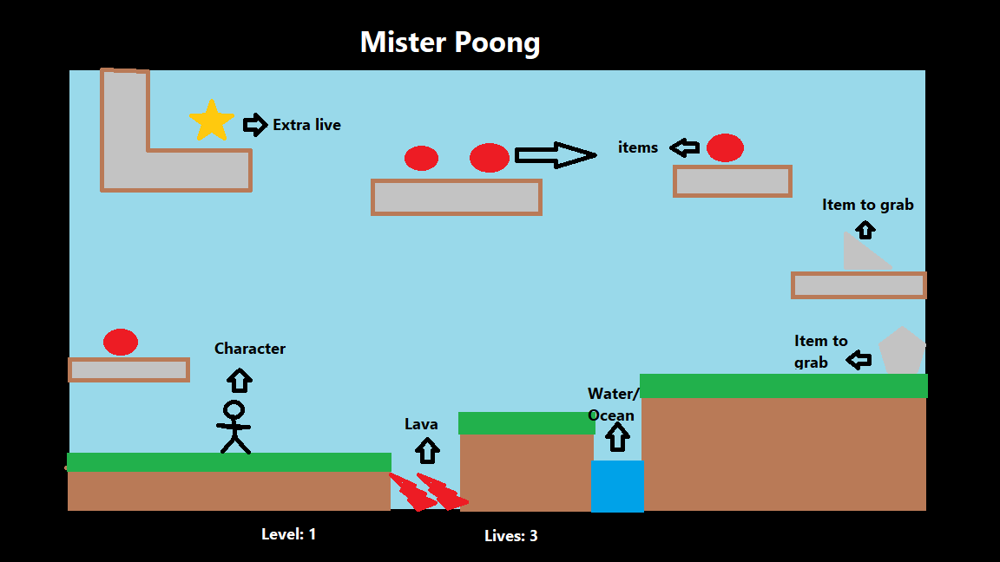

# Mister Poong

<!--  -->
</img>

## Background

Mister Poong is a platform game where you can move through the levels collecting 
different items and rewards.
This game will also have some challenging parts where the player needs to use the different character abilities 
in order to pass to the next level.

You can try it [here](https://zabala9.github.io/Mister-Poong/)

------------------------------------------------------------------------------------------------------------------------

## Functionality & MVPs

### In Mister Poong, users will be able to:
- The player can walk, jump, destoy walls, invert the gravity, swim, grab elements.
- Advance from one level to the next by collecting all the items.
- The player starts with 3 lifes and the game will over if lose all lives falling into the gaps or lava.

### In adition this project will include:
- instructions
- README

------------------------------------------------------------------------------------------------------------------------

## Wireframe

</img>

-------------------------------------------------------------------------------------------------------------------------

## Technologies
- JavaScript
- Webpack
- HTML canvas
- CSS

-------------------------------------------------------------------------------------------------------------------------

## Implementation Timeline

- Friday and Weekend: get a basic framework of the game. Get the character to move around
- Monday: Introduce the abilities for the character.
- Tuesday: Include instruction page.
- Wednesday: Introduce multiple levels.
- Thursday morning: Refine last details.
