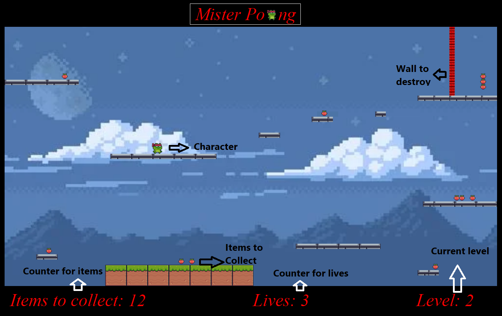

# Mister Poong

<!--  -->
</img>

## Background

Mister Poong is a platform game where you can move through the levels collecting 
different items and rewards.
This game will also have some challenging parts where the player needs to use the different character abilities 
in order to pass to the next level.

You can try it clicking [here!](https://zabala9.github.io/Mister-Poong/)

------------------------------------------------------------------------------------------------------------------------

## Functionality & MVPs

### In Mister Poong, users will be able to:
- The player can walk, jump and destroy walls.
- The player is able to pause the game.
- Advance from one level to the next by collecting all the items.
- The player starts with 3 lives and the game will over if lose all lives falling into the gaps.

### In adition this project will include:
- instructions
- README

------------------------------------------------------------------------------------------------------------------------

## Wireframe

</img>

- nav links include links to this project's Github repo and my LinkedIn.

-------------------------------------------------------------------------------------------------------------------------

## Technologies
- JavaScript
- Webpack
- npm
- HTML canvas
- CSS

-------------------------------------------------------------------------------------------------------------------------

## Code Snippets

Change character animation depending on the action (run, jump, fall)

```js
swapAnimation(key){
    if(this.image === this.animations[key].image || !this.loaded) return
    
    this.positionSubImg = 0;
    this.image = this.animations[key].image;
    this.subImgs = this.animations[key].subImgs;
    this.velSubImg = this.animations[key].velSubImg;
}

if(KEYS.d.typed){
    /*when I press an expecific key I want to swap the animation */
    this.swapAnimation('Run');
    this.velocity.x = 3;
    this.lastDirection = 'right';
} else if(KEYS.a.typed){
    this.swapAnimation('RunLeft');
    this.velocity.x = -3;
    this.lastDirection = 'left';
} else if(this.velocity.y === 0){
    if(this.lastDirection === 'right'){
        this.swapAnimation('Idle');
        if(KEYS.c.typed){
            this.swapAnimation('WallJump');
        }
    } else {
        this.swapAnimation('IdleLeft');
        if(KEYS.c.typed){
            this.swapAnimation('WallJumpLeft');
        }
    }
}
```

Collision blocks with the item

```js
checkCollisionItems(){
    for(let i =0; i < itemBlocks.length; i++){
        const item = itemBlocks[i];

        if(this.position.y + this.height >= item.position.y &&
            this.position.y <= item.position.y + this.heightItem &&
            this.position.x <= item.position.x + this.widthItem &&
            this.position.x + this.width >= item.position.x){
                //deleting item when the collision happens
                itemBlocks.splice(i, 1);

                break;
        }
    }
}
```

Check when the charater is out of bounds

```js
checkCharacterOutOfBounds(){
    if(this.position.y + this.width > this.dimensionsCanvas.height){
        lives1 = lives1-1;

        this.position.x = 20;
        this.position.y = 500;
    }
}
```
